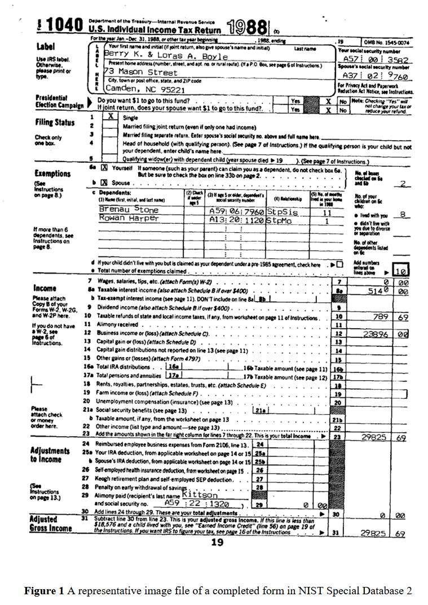

# Document Similarity Comparision 

## Optional dataset choice: 

1. NIST Structured Forms Reference Set of Binary image 
   1. dataset is composed of 5,590 tax forms from theaIRS 1040 for year 1988. 
   2. It diverse from schedules and forms. 
   3. It meats the idea of having different application form 
   4. [links](https://www.nist.gov/srd/nist-special-database-2)

- figure screen shot of 1040 form in 1988
